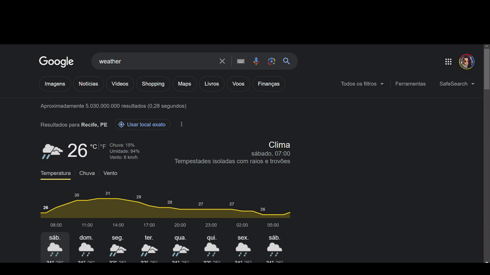

# Chrome Extension: Search Page Interface Enhancer

## Overview
Transform your Chrome new tab experience with a dynamic and functional interface. Say goodbye to mundane backgrounds and hello to a fresh look every time you open a new tab!

## Features
- **Dynamic background:** Each time you open a new tab, the background changes, keeping things fresh.
- **Random jokes:** A joke in the welcome panel adds a touch of fun to your experience, and it changes dynamically too.
- **Top sites at your fingertips:** Access your most visited websites with just a click.

## Installation and Usage
1. Clone or download this repository.
2. Open Google Chrome and navigate to `chrome://extensions/`.
3. Enable Developer Mode.
4. Click on "Load unpacked" and select the directory where you cloned/downloaded this repository.
5. Now you can open a new tab and and experience it for yourself!

## Contributing
Did you miss something? Feel free to submit a PR containing the following description template:

> ## What? 
> *[Provide a brief description of what your PR is adding, updating, or fixing.]*

> ## How?
> *[Are there any new technologies being added? How did you make your decisions? Provide any information you think could be helpful.]*

> ## Why?
> *[It is important to understand why decisions were made so that the review process can be more efficient.]*

